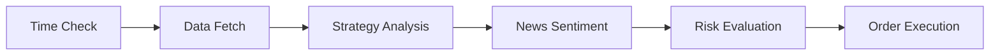

# IST-Bericht: Forex Trading Agent 🤖

**Datum:** 25.01.2026  
**Status:** Vollständige Projektanalyse  
**Erstellt mit:** writing-professional-docs, software-architecture, managing-project-tasks Skills

---

## Executive Summary

Das **Forex Trading Agent** Projekt ist ein containerisierter, automatisierter Forex-Trading-Bot, der auf einer **3-Layer-Architektur** basiert. Der Agent läuft stündlich (1H-Timeframe), analysiert Marktdaten, generiert Signale via SMA-Crossing-Strategie und führt Trades über den IG Broker aus.

> [!IMPORTANT]
> Das Projekt befindet sich in einem **funktionsfähigen Zustand** (Phase 3 abgeschlossen), jedoch sind Testing-Aufgaben (Phase 5) noch offen.

---

## 1. Projektstruktur

```
Forex Agent/
├── core/                   # Kern-Module (Engine, Models, Database)
├── execution/              # Trading-Logik (Strategien, Broker, Risk)
│   ├── brokers/            # IG Broker & Mock Broker
│   ├── strategies/         # Trading-Strategien
│   └── data_sources/       # Datenquellen-Adapter
├── data/                   # Marktdaten & MCP-Client
├── macro_server/           # FastAPI-Server für externe Daten
├── directives/             # SOPs & Contracts (13 Dateien)
├── reports/                # Technische Reports
├── Notebook/               # Dokumentation & Analysen
└── .agent/skills/          # 28+ Skills für AI-Unterstützung
```

---

## 2. Architektur

### 2.1 3-Layer-Modell

| Layer | Zweck | Haupt-Dateien |
|:------|:------|:--------------|
| **Directives** | SOPs, Contracts, Regeln | `directives/*.md` |
| **Execution** | Trading-Logik & Broker | `execution/run_cycle.py`, `core/engine.py` |
| **Orchestration** | Scheduling & Coordination | `main_loop.py`, `docker-compose.yml` |

### 2.2 Datenfluss (6-Schritt-Pipeline)



1. **Time Check** - Prüft Handelszeiten (Weekend-Filter)
2. **Data Fetch** - YFinance/IG API mit Retry-Logik
3. **Strategy** - SMA Cross (50/200), generiert LONG/SHORT/HOLD
4. **News Filter** - MCP-Client für Sentiment-Analyse
5. **Risk Eval** - Positionsgröße (2% Regel), SL/TP Berechnung
6. **Execution** - IG Broker oder MockBroker

---

## 3. Komponenten-Status

### 3.1 Kern-Module (`core/`)

| Datei | Status | Funktion |
|:------|:-------|:---------|
| [engine.py](file:///c:/Users/lenna/Downloads/Antigravity/Forex%20Agent/core/engine.py) | ✅ Implementiert | `TradingEngine` Klasse mit `run_cycle()` |
| [database.py](file:///c:/Users/lenna/Downloads/Antigravity/Forex%20Agent/core/database.py) | ✅ Implementiert | SQLite via SQLAlchemy |
| [models.py](file:///c:/Users/lenna/Downloads/Antigravity/Forex%20Agent/core/models.py) | ✅ Implementiert | `TradeResult` Model |
| [signals.py](file:///c:/Users/lenna/Downloads/Antigravity/Forex%20Agent/core/signals.py) | ✅ Implementiert | `Signal`, `SignalType` Enums |
| [config.py](file:///c:/Users/lenna/Downloads/Antigravity/Forex%20Agent/core/config.py) | ✅ Implementiert | Pydantic Settings |

### 3.2 Execution (`execution/`)

| Komponente | Dateien | Status |
|:-----------|:--------|:-------|
| **Run Cycle** | [run_cycle.py](file:///c:/Users/lenna/Downloads/Antigravity/Forex%20Agent/execution/run_cycle.py) | ✅ Produktionsreif |
| **Broker IG** | [ig_broker.py](file:///c:/Users/lenna/Downloads/Antigravity/Forex%20Agent/execution/brokers/ig_broker.py) | ✅ Verbindung getestet |
| **Mock Broker** | [mock_broker.py](file:///c:/Users/lenna/Downloads/Antigravity/Forex%20Agent/execution/brokers/mock_broker.py) | ✅ Für Tests |
| **Strategie** | [baseline_sma_cross.py](file:///c:/Users/lenna/Downloads/Antigravity/Forex%20Agent/execution/strategies/baseline_sma_cross.py) | ✅ SMA 50/200 |
| **Risk Mgmt** | `risk.py`, `risk_eval.py`, `risk_limits.py` | ✅ 2% Regel |
| **Order Router** | [execute_order.py](file:///c:/Users/lenna/Downloads/Antigravity/Forex%20Agent/execution/execute_order.py) | ✅ Mit Idempotenz |
| **State Manager** | `state_manager.py` | ✅ Verhindert Doppel-Execution |
| **Logger** | [logger.py](file:///c:/Users/lenna/Downloads/Antigravity/Forex%20Agent/execution/logger.py) | ✅ JSON + CSV |

### 3.3 Daten (`data/`)

| Komponente | Datei | Status |
|:-----------|:------|:-------|
| **MCP Client** | [mcp_client.py](file:///c:/Users/lenna/Downloads/Antigravity/Forex%20Agent/data/mcp_client.py) | ✅ Sentiment API |
| **YFinance** | [yfinance_provider.py](file:///c:/Users/lenna/Downloads/Antigravity/Forex%20Agent/data/yfinance_provider.py) | ✅ Fallback-Daten |

### 3.4 Macro Server (`macro_server/`)

| Feature | Status |
|:--------|:-------|
| FastAPI App | ✅ Implementiert |
| Eigenes Dockerfile | ✅ Vorhanden |
| Deploy auf Railway | ✅ Dokumentiert |

---

## 4. Deployment

### 4.1 Docker-Konfiguration

```yaml
# docker-compose.yml
services:
  agent:
    build: .
    restart: always
    volumes:
      - ./trade_journal.csv:/app/trade_journal.csv
      - ./logs:/app/logs
      - ./trades.db:/app/trades.db
    env_file: .env

  macro-server:
    build: ./macro_server
    ports: ["8000:8000"]
```

### 4.2 Starten

```bash
docker-compose up --build -d
docker-compose logs -f agent
```

### 4.3 Guardrails

| Gate | Implementierung |
|:-----|:----------------|
| **DEMO/LIVE Mode** | `IG_ACC_TYPE` in `.env` |
| **Symbol Allowlist** | `config.BROKER_ALLOWLIST` |
| **Max Lots** | `RiskConfig.max_open_lots` |
| **Idempotenz** | `StateManager` + UUID |

---

## 5. Task-Plan Status

Basierend auf [task_plan.md](file:///c:/Users/lenna/Downloads/Antigravity/Forex%20Agent/task_plan.md):

### Phase 1: Foundation ✅
- [x] Audit Dependencies
- [x] Setup Pydantic Settings
- [x] Environment Variables
- [ ] Linting (ruff.toml) - **OFFEN**

### Phase 2: Core Architecture ⏳
- [x] Interfaces (IBroker, IDataSource, IStrategy)
- [x] Broker Refactoring
- [ ] Trading Engine in `execution/engine.py` - **OFFEN**
- [ ] Refactor Data Sources - **OFFEN**
- [ ] Scheduler `run_forever.py` - **OFFEN**

### Phase 3: Deployment ✅
- [x] Dockerize Agent
- [x] Orchestrate (docker-compose)
- [x] Deploy + 24/7 Verifiziert

### Phase 4: Stability ✅
- [x] Typed Signals (Enums)
- [x] Unified Logging (JSON)
- [x] Database Integration

### Phase 5: Testing ❌
- [ ] Unit Tests (Risk & Strategy) - **OFFEN**
- [ ] Integration Tests (MockBroker) - **OFFEN**

---

## 6. Trade Journal Analyse

Aus [trade_journal.csv](file:///c:/Users/lenna/Downloads/Antigravity/Forex%20Agent/trade_journal.csv) (35 Einträge):

### Zusammenfassung

| Metrik | Wert |
|:-------|:-----|
| **Zeitraum** | 19.01.2026 - 25.01.2026 |
| **Hauptsymbol** | USDJPY (primär), EURUSD (initial) |
| **Ausgeführte Trades** | ~15 SUBMITTED/FILLED |
| **Übersprungen** | 7 (Weekend Filter) |
| **Fehlgeschlagen** | 5 FAILED |

### Letzte Aktivität

```
2026-01-25T11:00 - USDJPY - SKIPPED (Weekend Sunday Pre-Open)
2026-01-25T05:00 - USDJPY - SKIPPED (Weekend Sunday Pre-Open)
```

> [!NOTE]
> Der Agent läuft kontinuierlich und überspringt korrekt Wochenend-Perioden.

---

## 7. Skills Inventar

28 Skills in `.agent/skills/` verfügbar, darunter:

| Kategorie | Skills |
|:----------|:-------|
| **Trading** | forex-strategy-creator, forex-strategy-optimizer, analyzing-market-data |
| **Architektur** | software-architecture, senior-architect, architecture |
| **Code-Qualität** | clean-code, code-review-checklist, testing-patterns |
| **Dokumentation** | writing-professional-docs, documentation-templates |
| **Projekt-Mgmt** | managing-project-tasks, planning-with-files, kaizen |

---

## 8. Offene Punkte & Empfehlungen

### Kritisch

| # | Bereich | Problem | Empfehlung |
|:--|:--------|:--------|:-----------|
| 1 | Testing | Keine Unit/Integration Tests | Phase 5 priorisieren |
| 2 | Linting | ruff.toml nicht konfiguriert | Einrichten + CI |

### Verbesserungen

| # | Bereich | Vorschlag |
|:--|:--------|:----------|
| 3 | Strategy | Weitere Strategien hinzufügen (RSI, MACD) |
| 4 | Monitoring | Prometheus/Grafana Integration |
| 5 | Alerts | Telegram/Discord Benachrichtigungen |

---

## 9. Chatverlauf-Zusammenfassung

Basierend auf den letzten 20 Konversationen:

| Datum | Hauptthema |
|:------|:-----------|
| 25.01.2026 | IST-Stand Analyse, Server-Erklärung |
| 24.01.2026 | Bot Execution Logs, Docker-Probleme, Agent Skill Protocol |
| 24.01.2026 | Clean Code Reviews, Task-Listen erstellt |
| 24.01.2026 | Skill-Auswahl für Projekt, Agent Execution Flow Dokumentation |

### Wichtige Entscheidungen aus Chatverläufen

1. **Stündlicher Trigger** - Agent läuft auf 1H-Kerzen-Basis
2. **SQLite statt PostgreSQL** - Einfachere Deployment
3. **YFinance als Fallback** - Wenn IG-API nicht erreichbar
4. **Weekend-Filter** - Automatisches Überspringen

---

## 10. Fazit

Das Projekt ist **funktional und deployed**. Die Kernarchitektur ist solide, die 3-Layer-Trennung ist implementiert, und der Agent führt automatisiert Trades aus. 

**Nächste Schritte:**
1. Unit Tests für Risk & Strategy schreiben
2. Integration Tests mit MockBroker
3. Linting-Konfiguration abschließen
4. Weitere Strategien entwickeln

---

*Erstellt mit Antigravity AI unter Verwendung der Skills: writing-professional-docs, software-architecture, managing-project-tasks*
